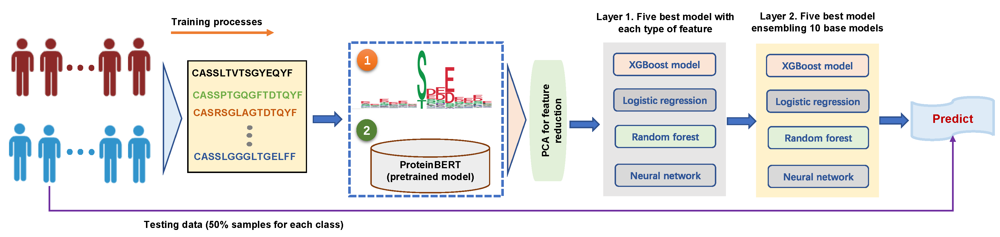

# A Multi-Layer Machine Learning Approach for Tumor Diagnosis and Staging

<p align="center">
	
</p>

# Installation

If you want to use TCRDiag, please clone github repository on your own machine in a desired folder
```
 git clone https://github.com/SolonJ-bio/TCRDiag.git
 cd TCRDiag
```
To run TCRDiag, you need to configure the corresponding R packages. If they are not installed in your environment, run the following command to install them first:
```
 install.packages(c('dplyr', 'Seurat', 'caret', 'glmnet', 'xgboost', 'randomForest', 'nnet', 'pROC', 'immunarch'))
 
```